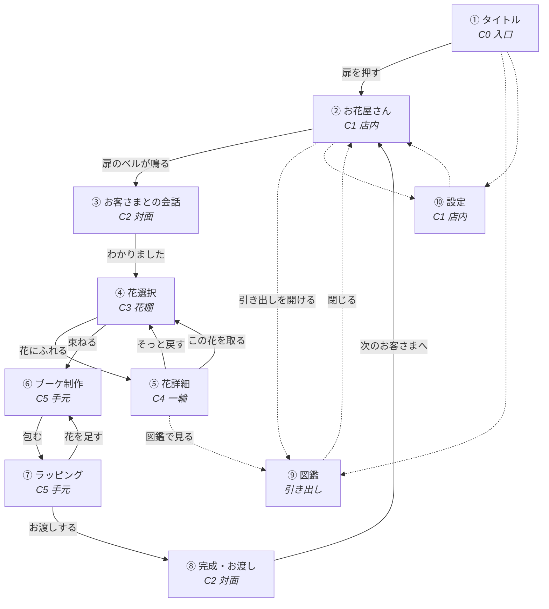

# ① 画面遷移図

## 1. カメラという考え方

このゲームに「画面」はありません。あるのは**ひとつの花屋**と、その中を動く**カメラ**です。

店の中に6つの立ち位置を決めます。画面はこの立ち位置に名前を付けたものです。

| カメラ | 立ち位置 | 見えるもの | 使う画面 |
|---|---|---|---|
| **C0 入口** | 扉のところ。いちばん引き | 店内の全景。窓・棚・カウンター | ① タイトル |
| **C1 店内** | カウンターの手前 | 店の骨格。窓と作業台 | ② お花屋さん ／ ⑩ 設定 |
| **C2 対面** | カウンター越し、少し寄る | お客さまの上半身 | ③ 会話 ／ ⑧ 完成 |
| **C3 花棚** | 作業台の花に寄る | 立ち並ぶ花。横に流れる | ④ 花選択 |
| **C4 一輪** | いちばん寄り。ピント最浅 | 花一本だけ | ⑤ 花詳細 |
| **C5 手元** | 少し見おろす | 束ねている手元 | ⑥ ブーケ ／ ⑦ ラッピング |

⑨図鑑だけはカメラを動かしません。**木の引き出しが手前にせり上がってくる**扱いにします。

---

## 2. 遷移図



実線が一日の流れ、点線がいつでも行き来できる場所です。  
**行き止まりを作りません。** どの画面からも、かならず店内（②）へ戻れます。

---

## 3. 遷移ごとの演出

すべての遷移は **「カメラが動く」＋「ピントが送られる」** の2つだけで作ります。
新しい演出の語彙を増やしません。

| # | 遷移 | 動き | 時間 |
|---|---|---|---|
| 1 | 起動 → ① | 暗い店内が、窓からの光でゆっくり明るくなる。埃が舞い始める | 1.1s |
| 2 | ① → ② | カメラが前へ進む（1.06倍）。タイトル文字は先に消える | 0.62s |
| 3 | ② → ③ | 扉のベル。お客さまが奥から歩み寄り、カメラが少し寄る | 0.9s |
| 4 | ③ → ④ | お客さまが半歩下がり、カメラが花のほうへ下りる | 0.62s |
| 5 | ④ 横移動 | 花が横に流れる。正面に来た一輪だけ、彩度と影が戻る | 0.34s |
| 6 | ④ → ⑤ | **背景が暗くなる → 花が前へ出る → 背景がぼける → 紙が下から上がる**（この順序を守る） | 0.34 → 0.62 → 0.34 s |
| 7 | ⑤ → ④ | 逆順。紙が下がり、花が戻り、明るさが戻る | 0.5s |
| 8 | ④ → ⑥ | カメラが手元へ下りる。取った花が一本ずつ手元へ集まる | 0.62s ＋ 0.1s×本数 |
| 9 | ⑥ ↔ ⑦ | カメラは動かない。棚だけが下からせり上がる | 0.34s |
| 10 | ⑦ 紙を選ぶ | 選んだ紙が、束のまわりに巻かれていく | 0.62s |
| 11 | ⑦ → ⑧ | カメラが引いて、お客さまが手を伸ばす | 0.9s |
| 12 | ⑧ 受け取り | 一拍おいて（0.4s）光が差し、笑顔になる | 1.1s |
| 13 | ⑧ → ② | 画面がゆっくり白く飛んで、次の朝になる | 0.9s |
| 14 | ② → ⑨ | 木の引き出しが下からせり上がる。店内は奥へ下がってぼける | 0.5s |
| 15 | ② → ⑩ | 紙が一枚、手前に置かれる | 0.34s |

### いちばん大事な遷移（⑥）

指示にあった流れを、そのまま順番に守ります。**同時に起こしません。**

```
0.00s  花にふれる
0.00s  ─ 花がふっと 6px 浮き、影が濃くなる            （0.2s）
0.10s  ─ 画面全体がゆっくり暗くなる                   （0.34s）
0.20s  ─ 選んだ花だけが前へ出て、大きくなる            （0.62s）
0.20s  ─ ほかの花と店内が、ぼけていく                 （0.34s）
0.45s  ─ 花にだけ、左上から光が当たる                 （0.62s）
0.70s  ─ 紙が下から上がってくる                       （0.5s）
0.90s  ─ 花の名前 → 花言葉 → 旬 → 用途 → 相性 の順に現れる（各 0.12s ずらし）
```

プレイヤーが最初に見るのは花で、文字はいちばん最後です。

---

## 4. 一日の流れ

```
朝、店を開ける（②）
   └ 扉のベル（③）── お客さまの想いを聞く
        └ 花を選ぶ（④⑤）── ここがいちばん長い時間
             └ 束ねる（⑥）
                  └ 包む（⑦）
                       └ 渡す（⑧）
                            └ また朝になる（②）
```

一巡の目安は **6〜10分**。うち **半分以上を④⑤（花を見ている時間）** に使えるよう、
他の画面は短く、言葉を少なくします。

急かす表示（残り時間・回数・連続記録）はどこにも置きません。
