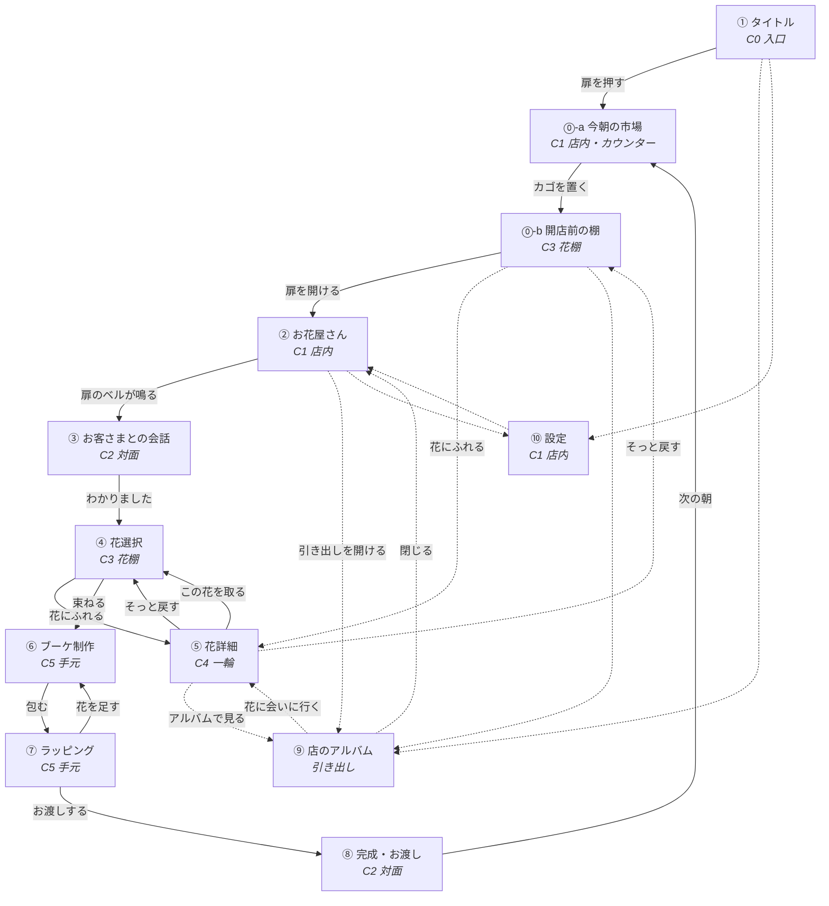

# ① 画面遷移図

> **改訂版。** ⓪感情設計書 6章の「8つの変更」と、⑭花の設計書を反映しました。

## 1. カメラという考え方

このゲームに「画面」はありません。あるのは**ひとつの花屋**と、その中を動く**カメラ**です。

店の中に6つの立ち位置を決めます。画面はこの立ち位置に名前を付けたものです。

| カメラ | 立ち位置 | 見えるもの | 使う画面 |
|---|---|---|---|
| **C0 入口** | 扉のところ。いちばん引き | 店内の全景。窓・棚・カウンター | ① タイトル |
| **C1 店内** | カウンターの手前 | 店の骨格。窓と作業台 | ② お花屋さん ／ ⑩ 設定 |
| **C2 対面** | カウンター越し、少し寄る | お客さまの上半身 | ③ 会話 ／ ⑧ 完成 |
| **C3 花棚** | 作業台の花に寄る | 立ち並ぶ花。横に流れる | **⓪開店前** ／ ④ 花選択 |
| **C4 一輪** | いちばん寄り。ピント最浅 | 花一本だけ | ⑤ 花詳細 |
| **C5 手元** | 少し見おろす | 束ねている手元 | ⑥ ブーケ ／ ⑦ ラッピング |

⑨アルバムだけはカメラを動かしません。**木の引き出しが手前にせり上がってくる**扱いにします。

### C3 は、二度使います

```
⓪ 開店前   お客さまが来る前。注文がない。目的がない     ← 花60%の入口
④ 花選択   お客さまの話を聞いたあと。選ぶために見る      ← 人生40%
```

**同じ棚を、二度見ます。** 一度目は理由なく、二度目は理由をもって。  
一度目に「かわいい」と思った花が、二度目に意味を持つ。これがこのゲームの背骨です。

---

## 2. 遷移図



実線が一日の流れ、点線がいつでも行き来できる場所です。  
**行き止まりを作りません。** どの画面からも、かならず店内（②）へ戻れます。

### 今回ふえた道は、3本だけです

| # | 道 | 何のためか |
|---|---|---|
| 1 | **⓪-a 市場 → ⓪-b 開店前の棚 → ②** | 花60%の入口。目的のない時間 |
| 2 | **⓪-b ⇄ ⑤ 花詳細** | 注文がなくても、花を見られる |
| 3 | **⑨ アルバム → ⑤ 花詳細** | 買わなくても、好きな花に会いに行ける |

**画面は2つ増えました**（⓪-a 市場、⓪-b 開店前の棚）。  
どちらも短く、**どちらも飛ばせます。** 見たい人だけが見る時間です。

---

## 3. 遷移ごとの演出

すべての遷移は **「カメラが動く」＋「ピントが送られる」** の2つだけで作ります。
新しい演出の語彙を増やしません。

| # | 遷移 | 動き | 時間 |
|---|---|---|---|
| 1 | 起動 → ① | 暗い店内が、窓からの光でゆっくり明るくなる。埃が舞い始める | 1.1s |
| 2 | ① → ⓪-a | カメラが前へ進む（1.06倍）。タイトル文字は先に消える | 0.62s |
| **3** | **⓪-a 市場** | **カウンターにカゴが置かれ、今日の花が1〜2種、上に乗る** | 0.9s |
| **4** | **⓪-a → ⓪-b** | **カメラが棚へ下りる。注文票もメモも出ない** | 0.62s |
| **5** | **⓪-b → ②** | **カメラが引く。扉の札が「open」に返る** | 0.62s |
| 6 | ② → ③ | 扉のベル。お客さまが奥から歩み寄り、カメラが少し寄る | 0.9s |
| 7 | ③ → ④ | お客さまが半歩下がり、カメラが花のほうへ下りる | 0.62s |
| 8 | ④ 横移動 | 花が横に流れる。正面に来た一輪だけ、彩度と影が戻る | 0.34s |
| 9 | ④ → ⑤ | **背景が暗くなる → 花が前へ出る → 背景がぼける → 紙が下から上がる**（この順序を守る） | 0.34 → 0.62 → 0.34 s |
| 10 | ⑤ → ④ | 逆順。紙が下がり、花が戻り、明るさが戻る | 0.5s |
| 11 | ④ → ⑥ | カメラが手元へ下りる。取った花が一本ずつ手元へ集まる | 0.62s ＋ 0.1s×本数 |
| 12 | ⑥ ↔ ⑦ | カメラは動かない。棚だけが下からせり上がる | 0.34s |
| 13 | ⑦ 紙を選ぶ | 選んだ紙が、束のまわりに巻かれていく | 0.62s |
| 14 | ⑦ → ⑧ | カメラが引いて、お客さまが手を伸ばす | 0.9s |
| 15 | ⑧ 受け取り | 一拍おいて（0.4s）光が差し、笑顔になる | 1.1s |
| 16 | ⑧ → ⓪-a | 画面がゆっくり白く飛んで、次の朝になる | 0.9s |
| 17 | ② → ⑨ | 木の引き出しが下からせり上がる。店内は奥へ下がってぼける | 0.5s |
| **18** | **⑨ → ⑤** | **アルバムの絵が、そのまま前へ出て大きくなる**（#9と同じ動き） | 0.62s |
| 19 | ② → ⑩ | 紙が一枚、手前に置かれる | 0.34s |

**#18が大事です。** アルバムの中の絵と、棚の花は**同じ絵**なので、
そのまま前へ出すだけで、花に会いに行ったことになります。別の演出を作りません。

### いちばん大事な遷移（④→⑤／⑨→⑤）

指示にあった流れを、そのまま順番に守ります。**同時に起こしません。**

```
0.00s  花にふれる
0.00s  ─ 花がふっと 6px 浮き、影が濃くなる            （0.2s）
0.10s  ─ 画面全体がゆっくり暗くなる                   （0.34s）
0.20s  ─ 選んだ花だけが前へ出て、大きくなる            （0.62s）
0.20s  ─ ほかの花と店内が、ぼけていく                 （0.34s）
0.45s  ─ 花にだけ、左上から光が当たる                 （0.62s）
0.70s  ─ 紙が下から上がってくる                       （0.5s）
0.90s  ─ 花の名前 → 花言葉 → 旬 → 値段 → 相性 の順に現れる（各 0.12s ずらし）
```

プレイヤーが最初に見るのは花で、文字はいちばん最後です。

### 音を鳴らさないところ

```
発見の瞬間          鳴らさない  （気づいたのはプレイヤーであって、システムではない）
♡お気に入りを押す    鳴らさない  （ご褒美にしない）
図鑑の欄が埋まる      鳴らさない  （集めるゲームにしない）
```

---

## 4. 一日の流れ

```
今朝の市場（⓪-a）      ── 今日の花が届く。5秒で終わる
   └ 開店前の棚（⓪-b）  ── ★目的がない時間。飛ばせる
        └ 店を開ける（②）
             └ 扉のベル（③）── お客さまの想いを聞く
                  └ 花を選ぶ（④⑤）── ここがいちばん長い時間
                       └ 束ねる（⑥）
                            └ 包む（⑦）
                                 └ 渡す（⑧）
                                      └ また朝（⓪-a）
```

一巡の目安は **7〜11分**。うち **半分以上を花を見ている時間（⓪-b・④・⑤）** に使えるよう、
他の画面は短く、言葉を少なくします。

### 時間の配分

| 場面 | 目安 | 60/40 |
|---|---|---|
| ⓪-a 市場 | 5〜15秒 | **花** |
| **⓪-b 開店前の棚** | **0秒〜2分**（人による） | **花** |
| ③ 会話 | 1分 | 人生 |
| ④⑤ 花を選ぶ | 3分半 | **花＋人生** |
| ⑥⑦ 束ねる・包む | 2分 | — |
| ⑧ 渡す | 1分半 | 人生 |

**⓪-b が「0秒」でもいい**のが大事です。急ぐ人は素通りできます。  
それでも置いておくのは、**素通りしない人のため**です。

急かす表示（残り時間・回数・連続記録）はどこにも置きません。

---

## 5. のぶさんの日（束を作らない日）

毎週日曜、のぶさんは**一輪だけ**買っていきます（→ ⑫4章）。  
この日は、⑥⑦を通りません。

```
③ 会話  →  ④ 花選択  →  ⑤ 花詳細  →  ⑦ 紙一枚で包む  →  ⑧ 渡す
                                          ↑ ⑥ブーケ制作を飛ばす
```

**選ぶ時間は、いつもより長くしていい日**です。1本だから、迷いが濃くなります。

> この日があることで、このゲームが「ブーケを作るゲーム」ではないと、
> 遊びながら伝わります。
